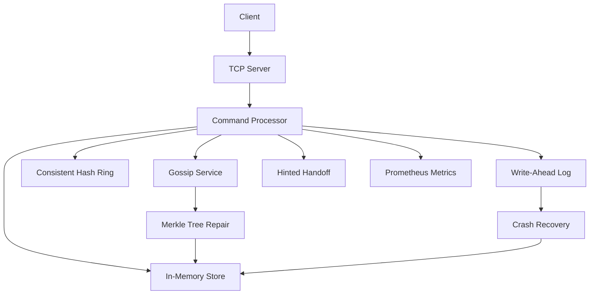
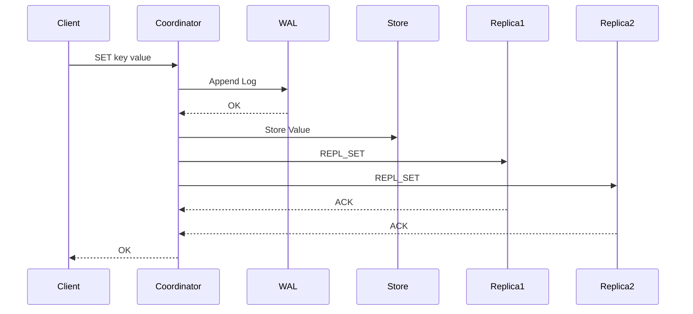
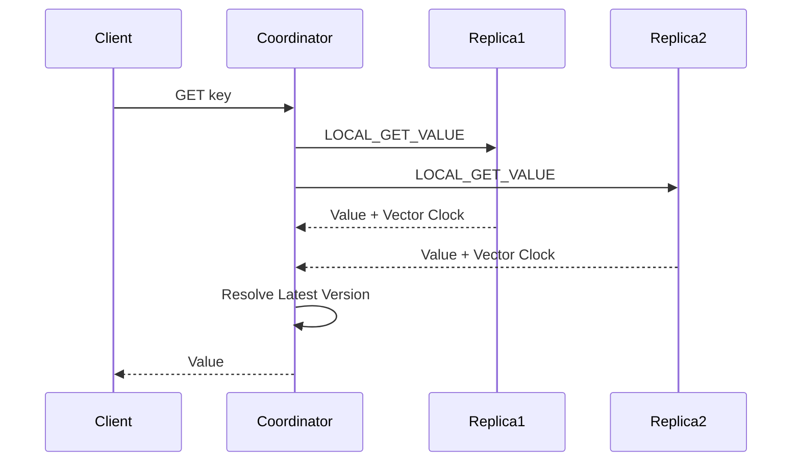

# MiniKV

> A distributed, fault-tolerant key-value store built in Go, implementing core distributed systems concepts such as consistent hashing, replication, write-ahead logging, vector clocks, Merkle trees, gossip-based failure detection, and hinted handoff.

MiniKV is an educational distributed database inspired by the architecture of modern distributed storage systems such as Amazon Dynamo. The project was built to explore how distributed key-value stores achieve scalability, fault tolerance, data consistency, and high availability while remaining simple enough to understand from first principles.

Unlike a traditional in-memory key-value store, MiniKV supports multi-node clusters, automatic data partitioning, replication, crash recovery, anti-entropy synchronization, and quorum-based reads and writes. The implementation emphasizes clean architecture, modular design, and testability, making it both a learning resource and a practical reference for distributed systems concepts.

## Table of Contents

- [Why MiniKV?](#why-minikv)
- [Features](#features)
- [Architecture](#architecture)
- [Write Request Flow](#write-request-flow)
- [Read Request Flow](#read-request-flow)
- [Quick Start](#quick-start)
- [Performance](#performance)
- [Project Structure](#project-structure)
- [Roadmap](#roadmap)
- [License](#license)

---

## Why MiniKV?

Distributed databases rely on several algorithms and protocols working together to provide reliability and availability. Instead of treating these concepts independently, MiniKV integrates them into a single project to demonstrate how they interact in a real system.

The project implements many of the building blocks found in production-grade distributed databases, including:

- Consistent Hashing with Virtual Nodes
- Replication with Configurable Read/Write Quorums
- Write-Ahead Logging (WAL)
- Crash Recovery
- Vector Clocks for Versioning
- Merkle Trees for Anti-Entropy Synchronization
- Gossip-based Failure Detection
- Hinted Handoff
- Connection Pooling
- Prometheus Metrics
- Unit and Integration Testing

## Features

| Feature                                    | Description                                                                                              |
| ------------------------------------------ | -------------------------------------------------------------------------------------------------------- |
| **Concurrent In-Memory Storage**     | Thread-safe key-value storage using Go's `sync.RWMutex` for concurrent reads and writes.               |
| **TCP-Based Client/Server Protocol** | Lightweight text-based protocol supporting `SET`, `GET`, `DEL`, and internal replication commands. |
| **Write-Ahead Logging (WAL)**        | Persists write operations before applying them to memory, ensuring durability and crash recovery.        |
| **Crash Recovery**                   | Automatically rebuilds the in-memory state by replaying WAL logs during startup.                         |
| **Consistent Hashing**               | Evenly distributes keys across cluster nodes while minimizing data movement when nodes join or leave.    |
| **Virtual Nodes**                    | Improves load balancing by assigning multiple virtual nodes to each physical node.                       |
| **Replication**                      | Replicates data across multiple nodes to improve fault tolerance and availability.                       |
| **Read/Write Quorums**               | Ensures configurable consistency guarantees using quorum-based operations.                               |
| **Vector Clocks**                    | Tracks object versions and detects concurrent updates without relying solely on timestamps.              |
| **Merkle Trees**                     | Performs anti-entropy synchronization by efficiently detecting replica inconsistencies.                  |
| **Gossip-Based Failure Detection**   | Periodically exchanges node health information to detect failures in the cluster.                        |
| **Hinted Handoff**                   | Stores temporary hints for unavailable replicas and replays them when the node recovers.                 |
| **Connection Pooling**               | Reuses TCP connections between nodes to reduce connection overhead during replication.                   |
| **Prometheus Metrics**               | Exposes operational metrics for monitoring request counts, latency, replication, and cluster health.     |
| **Unit & Integration Tests**         | Includes comprehensive unit tests for core components and integration tests for distributed behavior.    |

## Architecture

MiniKV follows a modular architecture where each component is responsible for a specific part of the distributed system.



The command processor acts as the coordinator of the system. Every client request is routed through the protocol layer, which determines ownership using the consistent hash ring, persists writes through the WAL, coordinates replication, and serves read/write requests. Supporting components such as gossip, hinted handoff, Merkle trees, and crash recovery work together to maintain consistency and fault tolerance across the cluster.

## Write Request Flow



## Read Request Flow



## Quick Start

### Prerequisites

- Go 1.24 or later
- Git

### Clone the repository

```bash
git clone https://github.com/Choudhary-Sahil099/MiniKV.git
cd MiniKV
```

### Install dependencies

```bash
go mod download
```

### Start a Three-Node Cluster

Open three separate terminals.

#### Terminal 1

```bash
go run ./cmd/server NodeA 5000
```

#### Terminal 2

```bash
go run ./cmd/server NodeB 5001
```

#### Terminal 3

```bash
go run ./cmd/server NodeC 5002
```

Each server automatically:

- Loads the latest snapshot (if available)
- Replays the Write-Ahead Log (WAL)
- Joins the consistent hash ring
- Starts gossip-based heartbeat monitoring
- Starts anti-entropy synchronization
- Enables hinted handoff replay
- Exposes Prometheus metrics

### Start the Client

Open another terminal.

```bash
go run ./cmd/client
```

You can now execute commands such as:

```text
SET name Sahil
GET name
DEL name
```

## Performance

MiniKV includes a concurrent load-testing tool to evaluate write throughput under a replicated three-node cluster.

### Benchmark Configuration

| Configuration      | Value   |
| ------------------ | ------- |
| Cluster Size       | 3 Nodes |
| Replication Factor | 3       |
| Total Requests     | 10,000  |
| Concurrent Clients | 100     |
| Operation          | SET     |
| Transport          | TCP     |

### Results

| Metric             |               Value |
| ------------------ | ------------------: |
| Average Throughput | ~1,650 requests/sec |
| Average Duration   |              ~6.1 s |

> Benchmarks were executed on a local development machine. Results may vary depending on hardware, operating system, and storage performance. During testing, disk utilization reached approximately 90–97%, indicating that write-ahead logging (WAL) persistence was the primary performance bottleneck rather than CPU utilization.

## Project Structure

```text
MiniKV
├── benchmarks/          # Load testing utilities
├── cmd/
│   ├── client/          # Interactive CLI client
│   └── server/          # MiniKV server entry point
├── configs/             # Cluster configuration
├── internal/
│   ├── client/          # Connection pooling & networking
│   ├── cluster/         # Cluster membership
│   ├── config/          # Runtime configuration
│   ├── gossip/          # Gossip protocol & failure detection
│   ├── handoff/         # Hinted handoff
│   ├── hashring/        # Consistent hashing
│   ├── merkle/          # Merkle tree anti-entropy
│   ├── metrics/         # Prometheus metrics
│   ├── protocol/        # Command processing
│   ├── replication/     # Replication & quorum logic
│   ├── storage/         # Thread-safe key-value storage
│   ├── vectorclock/     # Versioning
│   └── wal/             # Write-ahead logging
├── tests/               # Integration tests
├── go.mod
├── README.md
└── LICENSE
```

## Roadmap

### Completed

- [X] Concurrent in-memory storage
- [X] TCP client/server protocol
- [X] Write-ahead logging
- [X] Crash recovery
- [X] Consistent hashing
- [X] Virtual nodes
- [X] Replication
- [X] Read/write quorums
- [X] Vector clocks
- [X] Merkle tree anti-entropy
- [X] Gossip-based failure detection
- [X] Hinted handoff
- [X] Connection pooling
- [X] Prometheus metrics
- [X] Benchmarking
- [X] Unit & integration tests

### Future Improvements

- [ ] HTTP/REST API
- [ ] Snapshot compaction
- [ ] Docker Compose deployment
- [ ] Grafana dashboard
- [ ] Dynamic cluster membership
- [ ] Automatic data rebalancing

## Acknowledgements

MiniKV was inspired by the concepts presented in:

- Amazon Dynamo: *Dynamo: Amazon's Highly Available Key-value Store* (DeCandia et al., SOSP 2007)
- Google File System (GFS)
- Apache Cassandra
- Riak KV

The project was built as an educational implementation to better understand the core algorithms behind modern distributed databases.

## License

This project is licensed under the MIT License. See the [LICENSE](LICENSE) file for details.
